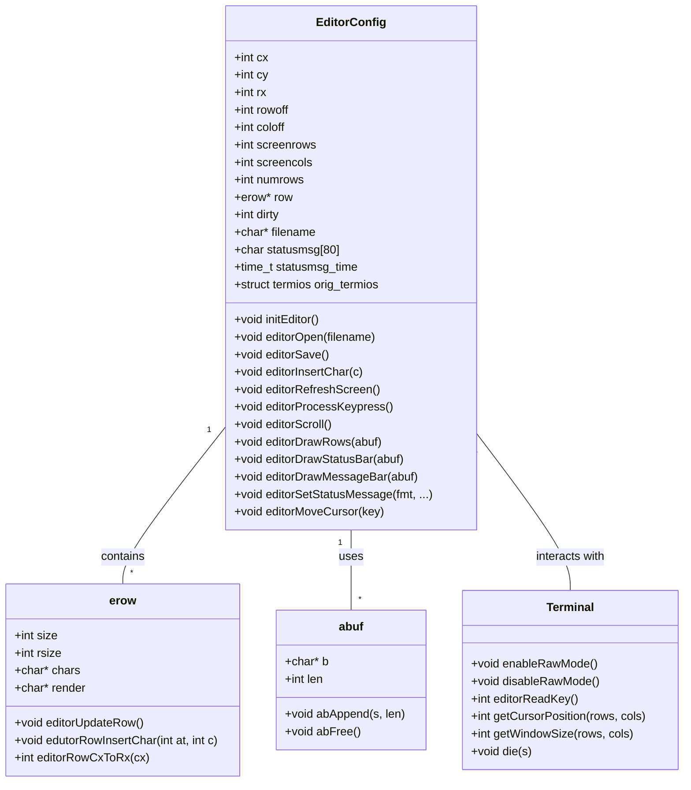

# Text Editor

A simple, terminal-based text editor written in C. It supports basic text editing operations, like moving the cursor, inserting characters, and reading/writing files. The editor is designed to be lightweight, interactive, and run entirely in the terminal using raw mode for better performance.

## Features

- **Raw mode input handling** for fast, responsive interaction.
- **Cursor movement** with arrow keys, home/end, and page up/down.
- **Basic file operations**: open files for reading.
- **Basic text editing**: insert characters at the cursor, handle backspace and delete.
- **Status bar** to display file information and cursor position.
- **Message bar** to show temporary status messages.

## Requirements

To build and run this text editor, you need:

- A Unix-like operating system (Linux, macOS, etc.)
- A C compiler (e.g., `gcc` or `clang`)
- Basic C libraries (e.g., `<stdio.h>`, `<stdlib.h>`, `<string.h>`, etc.)

## Installation

## Clone the Repository to your local machine:
   `
   git clone https://github.com/yourusername/texteditor.git
   cd texteditor
   ` 
## Compile the Code

Compile the program using gcc or clang:

`gcc -o texteditor texteditor.c`

## Run the Text Editor

Run the compiled text editor program:

`./texteditor [filename] `

If a filename is provided, the editor will open that file. If no filename is provided, the editor will start with a blank screen.

## Key Bindings

Arrow keys: Move the cursor around the text.

Ctrl-Q: Quit the editor.

Home/End: Move the cursor to the beginning or end of the line.

Page Up/Page Down: Scroll up or down by a page of text.

Backspace/Delete: Delete the previous or next character.

Ctrl-L: Redraw the screen (useful for refreshing after clearing parts of the screen).

# Architecture

The editor is composed of several key components:

## Raw Mode Handling:

The program enters "raw mode" to handle input directly, without any input processing by the terminal.

Input is read one character at a time using read(), and special characters (like arrow keys) are interpreted using escape sequences.

## Editor State:

The editor maintains a state, including the cursor position, number of rows, and the text being edited.

Text is stored in rows (erow), with each row containing the actual characters, the rendered version, and their sizes.

## Rendering:

The editor renders text to the screen row by row, handling line breaks and converting tabs to spaces based on the configured tab stop.

The screen is redrawn each time the user presses a key, with the editor updating the status bar, message bar, and editor content.

## Input Handling:

The editor reads keypresses and processes them accordingly. This includes character insertion, cursor movement, and file operations.

## File I/O:

The editor can open a file specified by the user and load its contents into memory, allowing editing.

Currently, the program supports reading from files but does not yet implement saving files.

# Structure

texteditor.c: The main source code for the text editor.

Includes and Defines: Defines macros for handling control characters and other constants, like the tab stop value.

Data Structures: Defines the erow struct (for rows of text) and the editorConfig struct (for global editor state).

Terminal Handling: Functions to enable/disable raw mode and to read keypresses.

Editor Operations: Functions to insert characters, move the cursor, update rows, etc.

Rendering: Functions to draw the text on the screen, manage the status bar, and scroll the content.

File I/O: Functions to open files and load their contents into the editor.

# UML

# License

This project is licensed under the GPL 3.0
